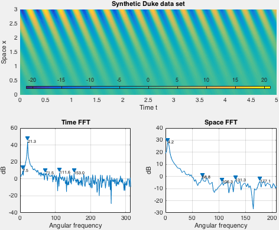
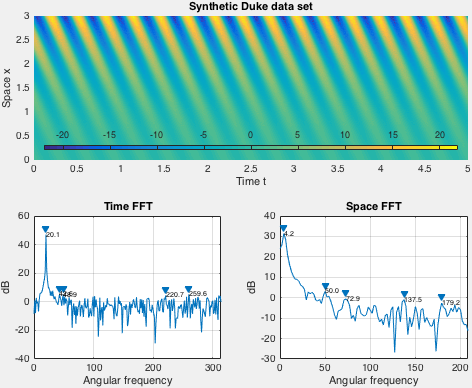
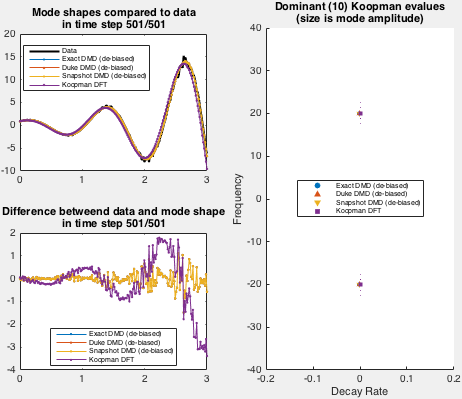

# KOOPMAN MODE DECOMPOSITION #
Matlab toolbox for Koopman mode decomposition.

Written by: Marko Budisic

The goal of this toolbox is to collect several common Koopman mode decomposition algorithms, in a documented, transparent code.

The code is licensed under a BSD3 license, found in the accompanying LICENSE file.

For the content of the package, please consult +koopman/Contents.m.

# Installation

Place the toolbox on the drive, e.g., to ~/MatlabToolbox/koopman, and add its top folder to Matlab path.

    >> addpath("~/MatlabToolbox/koopman")
    >> savepath

Then functions from the toolbox can be accessed via namespace "koopman", e.g.,

    >> koopman.DMD


# Use

## Basic syntax

Currently, the toolbox implements two algorithms based on Dynamic Mode Decomposition, and one algorithm based on Discrete Fourier Transform. All functions have similar syntax.

Let's suppose that a ```Snapshots``` matrix holds a multidimensional data sampled from a process, with each column corresponding to a snapshot at a single time instance, and snapshots taken at a time resolution of ```dt```.

To compute Koopman modes using the provided algorithms, run either of the three:

    >> [Spectrum, Modes, Amplitudes] = koopman.DMD( Snapshots, dt )
    >> [Spectrum, Modes, Amplitudes] = koopman.DMD_Duke( Snapshots, dt )
    >> [Spectrum, Modes, Amplitudes] = koopman.KDFT( Snapshots, dt )

Output variables are

* ```Spectrum```, a vector of complex frequencies, where positive real parts indicate growing modes, negative decaying modes, and imaginary parts give oscillation frequencies
* ```Modes```, matrix of spatial shapes, where complex-valued column corresponds to an element of ```Spectrum```,
* ```Amplitudes```, a vector of complex amplitudes that minimize the L2 distance between the input data, and the reconstruction

For further documentation, see help lines for individual functions in the koopman namespace.

## Demo

A demo (and validation) for the toolbox is located in koopman/validate folder. Once the namespace +koopman is in the path, demo can be run by

    >> cd [toolboxfolder]/validate
    >> DemoKoopmanModes

Demo implements an exponentially growing mode used by Duke et al. Spatial shape of the data set is fixed in demo, while the time behavior is set via arguments to the demo function.

Here is an example of the demo run for decay rate -0.1 and angular frequency 21:



Here is an example of the demo run for decay rate 0 and angular frequency 20:


